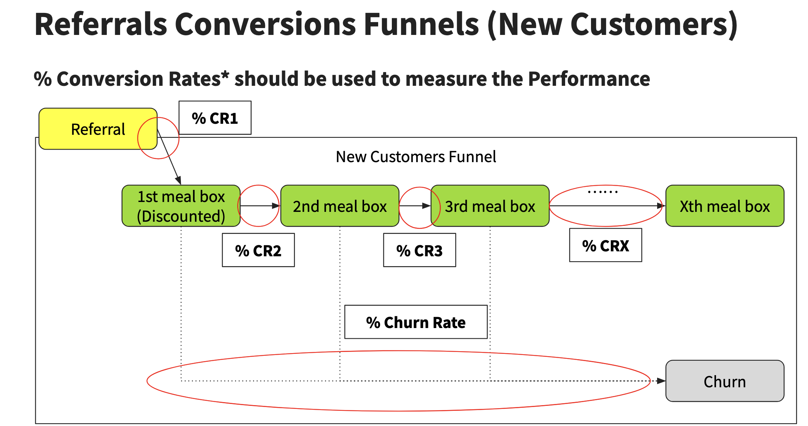

# Opportunities in the Decline of Referrals
MealKit Co. Product Analytics Case study

# Agenda

* Intro - Problem Statement (1 min)
* The Case Study (10 mins)
  * Referral Funnel
  * Analytical hypotheses
* Q & A (5 mins)

Timeline: 1h, 15min Q&A. Allow interruptions for small audiences.

# Intro - Problem Statement

* Referrals are an important source of **new customer acquisitions** for MealKit Co.
* Existing customers refer friend → both get discounts:
  * *new customer* off first meal box; 
  * *referrer* off next meal box.
* Referral performance declined last year. Product Owner asks Product Analyst to analyze *referrals conversions funnels* for improvement opportunities.

# The Case Study
Referrals Conversions Funnels, and the Analytical Hypotheses

## Referrals Conversions Funnels (Arbitrary)

### Acquisitions with a subscription model

Referral should be an action requires BOTH of the Referrer & New Customer, i.e. generate & share a referral code (Referrer), and use the referral code & subscribe (New Customer)

# Where could Referral performance go wrong?

# Referrals Conversions Funnels (New Customers)

% Conversion Rates* measure Performance

Given Subscription Model is in place, the definition & calculation of the % CR and % Churn Rate should be based on the number of Customers as the denominator, e.g. % CR1 = # New Customers having the 1st box with a referral code / # Referrers, where the definition of the Referrers should be “Customers who generated a referral code in the recent weeks”

# Proposed Metrics to track Referral Performance

Denominator:
* # Referrers: Existing customers generated code (W-1/W-2)
* # New Customers: Using code for 1st discounted box

Funnel:
* % CR1: 1st box / Referrers
* % CR2: 2nd / 1st box customers
* % CR3: 3rd / 2nd
* % Churn: Unsubscribed / 1st box (exclude 1-2 week pauses)

New Customers “pausing” for 1 week or 2 should NOT be included here.

# Hypotheses of declining Referral Performance

## Commercial
* Pricing: Aggressive discounts harm value
  * Segment by pricing (3x2 vs Premium)
  * Expected: Regular lower CR/higher churn; Premium better
* Meals/Ingredients:
  * Segment cuisines/recipes (veg vs omnivore)
  * Expected: Some combos bad performance

## Operations/SCM
* Late/Missing deliveries → churn
  * Expected: Late % correlates churn (summer); slows growth
* Delivery ETA inaccurate → churn
  * Expected: Logistics latency correlates churn
* Wrong/Missing/Replacements
  * Expected: Picking errors correlate churn; replacements higher churn

## Tech
* Funnel bugs (slow pages)
  * Expected: Bad tech → churn (may no correlation if silent churn)

Thanks for your time!
