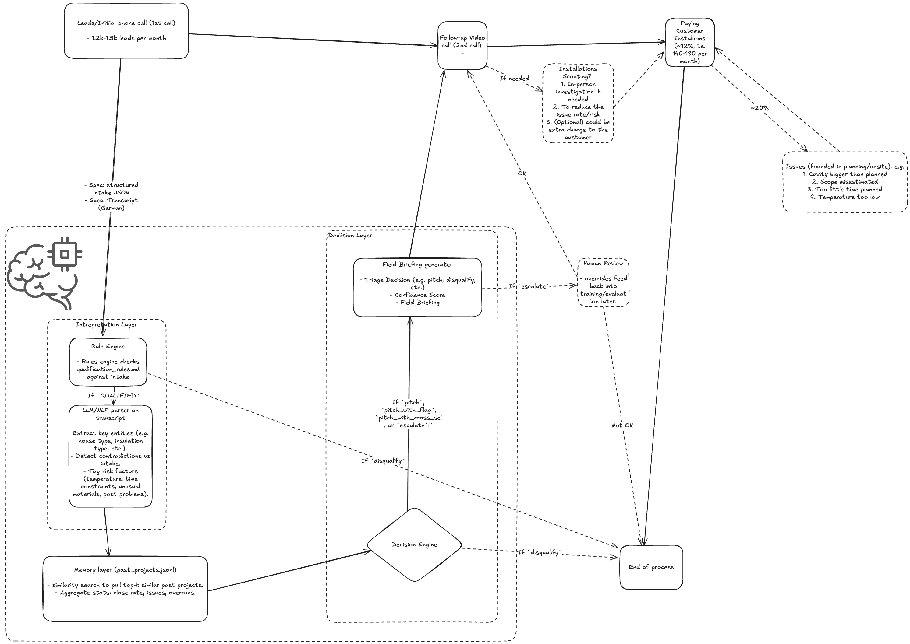

# Decision Log: ClimateTech Triage Layer

## What I Built

**Design choice — deterministic vs. LLM:** The Rule Engine runs first and is kept LLM-free because hard disqualifiers are binary and well-defined — a hallucinated "pass" costs a site visit. Deterministic logic is cheaper, faster, and fails loudly, which makes it auditable. The LLM is only invoked after the rule pass, for what rules can't do: parsing free-text, surfacing contradictions between the intake and the transcript, extracting entities that don't fit structured fields. Sonderfaktoren sit at the boundary — detected deterministically, but they trigger `escalate` rather than auto-pass because a positive override on a borderline disqualification warrants human judgement.

**Design choice — data literacy:** The structured intake is treated as a starting point, not ground truth. Reps make mistakes: a field logged as `has_hohlraum: true` may contradict what the customer said on the call. The LLM Parser's primary job is detecting these contradictions — not just extracting entities, but explicitly cross-checking intake fields against the transcript and flagging discrepancies. Flagged contradictions reduce the confidence score and surface in the briefing. This is the main place the system adds value over a rule checklist running on the intake alone.

**Confidence score:** a 1–5 integer composite. Rule violations lower it; a strong memory match (high close rate on similar past projects) lifts it. Anything ≤ 2 automatically overrides the triage decision to `escalate` rather than issuing a low-confidence pitch. This makes "confidence" actionable, not just a label.

**Input:** `intake.json` (structured CRM data) + `transcript.md` (free-text call recording) per lead.

Processed through three layers:

- **Interpretation Layer**
  - **Rule Engine** — runs first; cheap, deterministic hard disqualifiers with no hallucination risk. Driven by `qualification_rules.md`: product-specific rules (wall thickness, build year, region, façade type, building type) plus **Sonderfaktoren** — positive overrides that can flip a borderline disqualification but require human review, so they route to `escalate` rather than auto-pitch.
  - **LLM Parser** (Ollama / gemma3) — treats the intake as a starting point, not ground truth. Extracts entities and explicitly cross-checks them against the transcript (e.g., rep logged `has_hohlraum: true` but customer said otherwise). Flagged contradictions reduce the confidence score and surface in the briefing — this is where the system adds value beyond a rule checklist. Only earns its cost where structure is absent.
- **Memory Layer** — embedding similarity over 1,000 past projects from `data/past_projects.jsonl`, returning close rate, avg overrun, and common issues for comparable builds.
- **Decision Layer**
  - **Decision Engine** — synthesizes all signals into a final decision + confidence score (1–5 composite: rule violations lower it, strong memory match lifts it; ≤ 2 auto-routes to `escalate`).
  - **Field Briefing Generator** — takes the Decision Engine output and produces an actionable field doc for the sales rep's follow-up call.

**Output per lead:** triage decision (`pitch` / `pitch_with_flag` / `pitch_with_cross_sell` / `escalate` / `disqualify`) · confidence score · field briefing for the sales rep's follow-up call. All 10 leads processed; outputs in `output/`.

**Stack:** Python · FastAPI · Typer CLI · Ollama (cloud-first, local fallback) · uv · Docker

---

## How I'd Know This Works in Production

The triage layer produces four measurable failure modes:

| Failure | Symptom | Leading indicator |
|---|---|---|
| False disqualification | Lost revenue; qualified lead rejected | Rep overrides logged as `escalate → pitch` |
| False pitch | Wasted site visit; field team friction | On-site issues surfacing on leads that were `pitch` with no flag |
| Confidence miscalibration | Scores don't predict outcomes | Confidence ≤ 2 leads that closed vs. confidence 5 leads that bombed |
| Flag blindness | Relevant risks not surfaced in briefing | On-site issue rate for flagged vs. unflagged pitches |

**Short-term signal (days 1–30):** rep override rate. If reps are frequently overriding `disqualify` or ignoring `escalate`, the rule thresholds are miscalibrated. This is cheap to instrument before any labeled outcome data exists.

**Medium-term signal (90 days):** match triage decisions against actual outcomes — did `pitch` leads convert, did `disqualify` leads stay disqualified? A 20% on-site issue rate is the baseline; the layer should move that number on `pitch` leads while keeping the override rate low. Confidence score calibration can be checked here: a well-calibrated score 4–5 should close at a meaningfully higher rate than score 1–2.

**Drift:** re-run the full 10-lead batch on a fixed interval. If outputs shift without a code change, the LLM or embedding model has drifted. The rule engine output is deterministic and provides a stable regression anchor.

---

## What I Deliberately Didn't Build

| Skipped | Why |
|---|---|
| **Database** (kept in `src/legacy/db/`) | Stateless inference is simpler to run and test. Past projects load from `.jsonl` at startup. The legacy DB layer should only be wired back in when the added complexity is justified — e.g., if the ML pipeline is promoted and needs a structured training store. |
| **Frontend** | No proven use case. Sales reps need the briefing doc before a call — CLI + file output covers that. |
| **Classic ML pipeline** (kept in `src/legacy/`) | A 3-stage scikit-learn pipeline (issues → confidence → triage) was prototyped but parked. LLM-based reasoning is faster to iterate at this stage. The legacy models should only be promoted if we need more deterministic, auditable outputs at scale — or if LLM latency/cost becomes a bottleneck. |
| **Vector database** | Pure overhead at this scale. PostgreSQL with pgvector handles RAG retrieval for LLMs well enough at < 10k records — a dedicated vector DB adds infra cost with no measurable accuracy gain. |
| **LangGraph / multi-step LLM framework** | Each lead requires only a single-pass LLM call — no branching, retries, or agent loops. LangGraph earns its complexity only when multiple chained LLM steps are needed. If that changes, LangFuse becomes a natural companion for tracing those graphs. |

---

## What I'd Build Next

1. **Input Layer (translation + language normalisation)** — the system currently relies on the LLM to handle German transcripts implicitly. An explicit translation step before any parsing or rule evaluation normalises all input to English, which simplifies prompts, makes rule logic language-agnostic, and removes implicit language assumptions from every downstream component. Using English as the internal lingua franca also prepares the system for market expansion: adding a new country means wiring in one new source language, not auditing every prompt and rule for language sensitivity.
2. **Evaluation harness + lightweight backend UI** — once the POC is confirmed useful, a simple internal UI for ops to mark triage outcomes (was this call right, 90 days later?) provides the labeled data needed to measure drift. Pair with prompt management: store prompts in an OLTP table rather than hardcoding them, so the team can tune and pivot without a code deploy.
3. **Pricing guidance** — the field briefing currently flags risk but doesn't produce a price estimate. Accurate pricing requires predicting project-specific cost drivers (cavity size variance, access difficulty, regional labour rates) from sparse early-stage data — a problem that benefits from a dedicated ML pipeline trained on historical cost-vs-quote deltas rather than a single LLM pass. This is the next place the system can directly protect margin once labeled outcome data exists.
4. **Better foundation** — unit + integration tests in CI (end-to-end fixture runs catch contract breaks between layers); basic infra observability (Grafana/Loki) + AI observability (LangFuse) for token cost, latency, and prompt quality signals.
5. **ROI measurement** — instrument disqualification accuracy and on-site issue rate before/after. Answers whether the layer is working and where to invest next.
