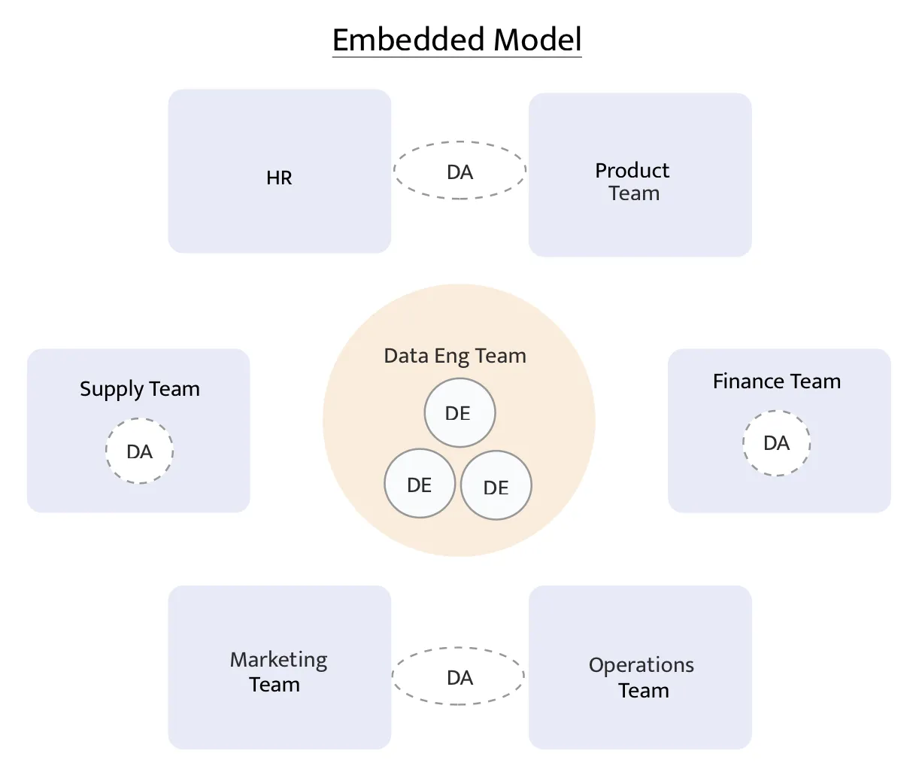
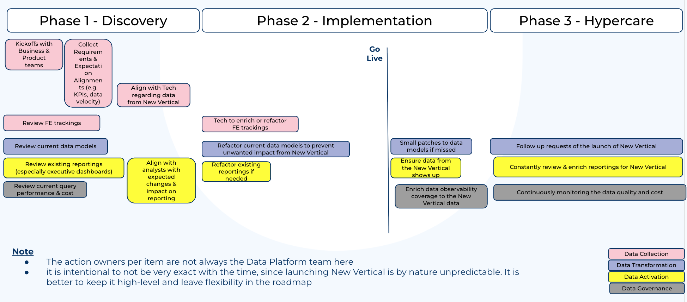
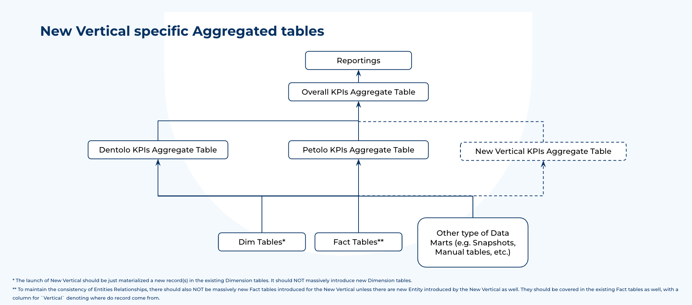
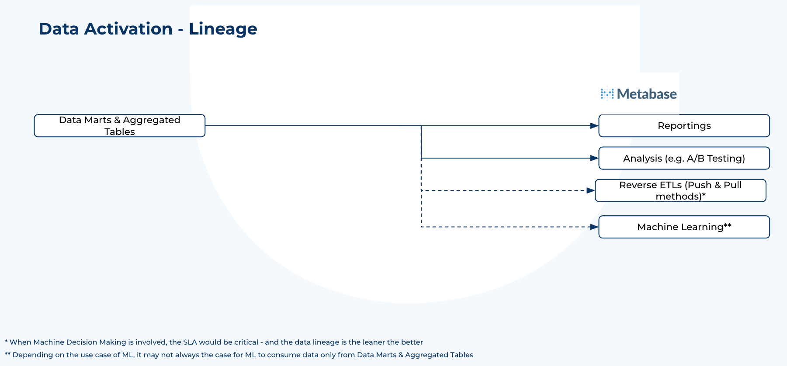
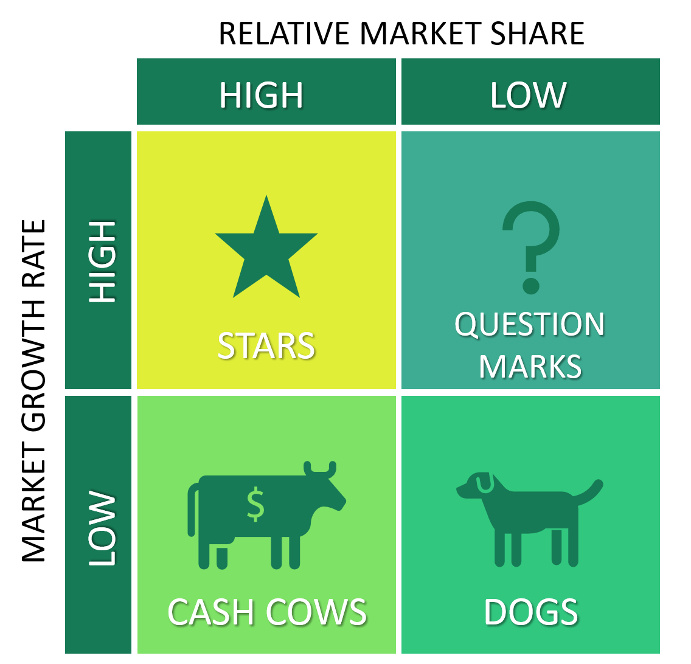
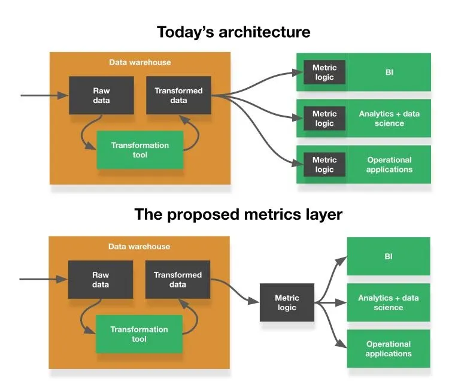
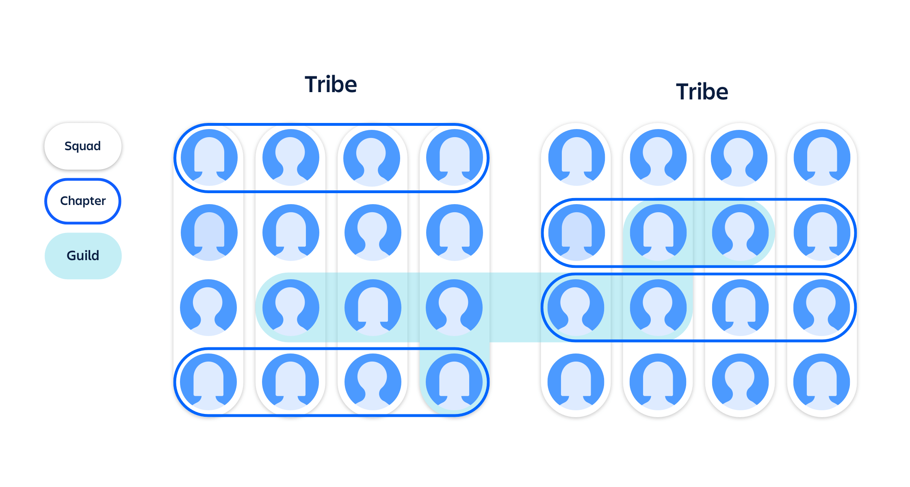

# Data Platform Lead Case Study

Jimmy Pang

# Agenda
1. The Case Study Interpretation
2. Proposed Roadmap
   - Phase 1 - Discovery
   - Phase 2 - Implementation
   - Phase 3 - Hypercare
3. Beyond the Roadmap
4. Appendix

# The Case Study Interpretation
And assumptions behind

# Case Study
## Background
- Insurance business in 1 Country - Germany
- 2 Verticals (on the same platform):
  - Dental insurance
  - Pet insurance

## The Task
- Business is launching the 3rd Vertical in Germany market
- Data Platform Roadmap: High-level overview, from Discovery to Go-Live

Reasoning to be entailed behind the proposal

## Interpretation & Assumptions
- Assuming to be a soft launch (i.e. no marketing effort at first)
- Launching New Vertical would have to involve Business, Tech, and Data Platform teams
- A task force is assumed to have assembled already, having at least 1 representing person from each team
- Data Visualization & Reporting assumed to be Business/Analysts' responsibilities (NOT Data Platform)

# Assumed Data Org - Embedded Model

- From the article [How should our company structure our data team?](https://medium.com/super/how-should-our-company-structure-our-data-team-e71f6846024d) by David Murray
- Assuming the Embedded Model is employed, i.e. Central Data Platform team + Decentralized Analysts

# Critical Components in Data Platform
- Data Collection & Ingestion: How is the data collected?
- Data Transformation:
  - How to make data easy to use efficiently?
  - Cost Management
- Data Activation: How to get the most value out from data?
- Data Governance:
  - How to ensure data being properly managed?
- Legal compliance: GDPR

# Proposed Roadmap
How Data Platform enable business

Proposed Roadmap

# Phase 1 - Discovery
Phase 1 is about **Discovery**, and **Expectation Alignment**.
Key points are as follows:

## Discovery
- From Business: Understand the timeline and expected business impact, including how to measure success and relevant KPIs
- From Tech: Understand involved tech components:
  - Frontend tracking
  - Expected change of backend data
- From Data Platform
  - Ensure all vital parts for making new vertical data available once Live
  - Understand the status quo of data models & reporting in order to prevent unexpected change in data quality and cost

## Expectation Alignment
- Align on timeline and capacity management
- Change Management
  - Communicate to all relevant stakeholders to mitigate risk and avoid frustration
  - Avoid unpleasant surprise

## Key Deliverables
- Aligned Expectations
- Communication Plan
- Clear Spec on both Tech & Data (especially dependencies)

# Phase 2 - Implementation
Phase 2 is about taking actions, regardless by the Data Platform team, business team, or the Tech team.

The Key points are as follows:

## Cross-Teams Collaboration
- Project Ownership is the key to ensure clear responsibilities
- Regular sync (e.g. weekly) would be vital to address the Cross-Teams Dependencies
  - Data Platform has hard dependency on Tech by nature
  - Business/Analysts also have hard dependency on Data Platform
  - Need to ensure the teams don't block each other

## Risk Mitigation
- It is possible that the existing data pipeline & reportings not fully prepared for the New Vertical
  - Business/Analysts needs to be informed and take precaution for that
- Depending on the expected volume from the New Vertical, the Data Platform team would also need to ensure the scalability of the data pipeline (i.e. Cost & runtime)

## Key Deliverables
- Coordinated actions at 3 fronts: Business, Tech, and Data Platform
- Discovered data & reporting vulnerability being addressed
- Quick responses to issues once go-live

# Phase 3 - Hypercare
Phase 3 is about post-launch follow ups, since tech & data evolution are always iterative.
The Key points are as follows:

## New Vertical Performance monitoring
- The focus of the regular sync ought to be slowly transiting into KPI review
- Business teams to perform various analysis if deeper dive is required

## Tech
- Constant monitoring the stability on the New Vertical site and relevant services
- Report to the task force

## Data Platform
- Address follow up relevant requests from business
- Governance: Constant monitoring data quality and queries runtime with the increased volume from the New Vertical launch

**Any detected anomaly should communicated ASAP** and escalated if needed

## Key Deliverables
- Translate the launch into tangible business performance impact
- Ensure the company is set for success and ready for future iterations

# Beyond the Roadmap
Deep Dive per Data Platform components

## Data Collection*

### Overview
- Data typically come from Frontend Tracking & Backend application(s)
- **Frontend Tracking**
  - Tracking tools (e.g. GA) to keep track of the users activity on the Websites/Mobile apps
  - Vital when it comes to having visibility of user behaviour before conversions

- **Backend application(s)**
  - The application supporting the websites/Mobile apps, usually backed by a transactional database
  - The database typically serves as the reliable source of data

### Technical Considerations
- FE Tracking Plan
  - Successful Tracking require proper planning, it needs to have clear business goals in heart (e.g. drive more %CR, # New Contracts, higher GWP)
  - Typically prep by Product Analytics, and implemented by Software Engineering
- Data Ingestion Pattern - Batch Processing vs Streaming
  - Depends on the dynamic of the insurance business
  - Likely Batch Processing is better for cost consideration
- Data Freshness (i.e. Weekly, Daily, Hourly, Near Real Time, etc.)
  - Similar to Data Ingestion Pattern
  - Balance between cost & velocity

GDPR compliance is critical in this context, details to be covered later

## Data Transformation
### Overview

- Era of EL*T* (Extract, Load, Transform)
- Dimensional Modelling* (aka Kimball model) employed, i.e.
  - Dimension Tables
  - Fact Tables (OBT flavour) → Denormalization as a best practice in Non-Relational DWH (e.g. Snowflake, BigQuery etc.)
  - Aggregated Tables → There ought to be BU and entity specific Aggregated tables

* Source: The Data Transformation Manifest

### New Vertical specific Aggregated tables

## Data Activation
- The part where data creates value
- Typically materialized in Decision Making by Humans and Machines
  - Humans: Data Visualization, A/B Testing, Data Analysis
  - Machines*: Reverse ETLs, Machine Learning, AI
- Metrics Layer** (aka Semantic Layer) remains "Question Marks"***

* To be paired with setting SLAs in Data Governance
** See details in Appendix

Data Activation - Lineage

## Data Governance

- A key component so vital yet got omitted by many companies
- Critical consideration for insurance business
  - PII data identification for **GDPR compliance**
- Data Catalog for data documentation & discovery
- Data Observability solution ought to be put in place as well, to keep track of evolution of
- Data Quality (including Data Anomaly and outliners)
- Query Performance on table level
- (If ML & Reverse ETL are in place) SLA to be set

# Appendix
Relevant Resources

## BCG (Boston Consulting Group) Matrix

## Metrics Layer (aka Semantic Layer)

From the article [The missing piece of the modern data stack](https://open.substack.com/pub/benn/p/metrics-layer?utm_campaign=post-expanded-share&utm_medium=web) by Benn Stancil

## Spotify Model

From the article [Discover the Spotify model](https://www.atlassian.com/agile/agile-at-scale/spotify).

Thank you!