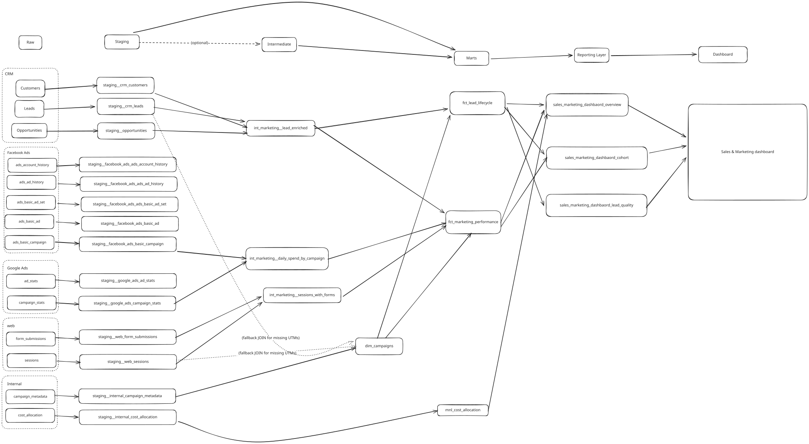
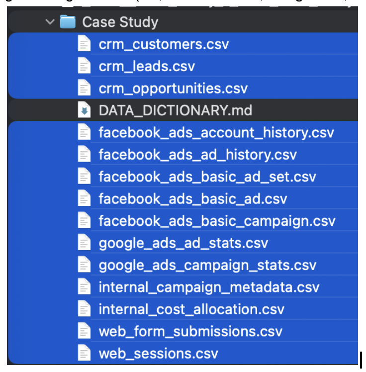

# Case Study Spec

# Staff Data Analyst \- Case Study

## Jimmy Pang

This doc has two parts: 

1. Sections 0–7 with the proposed MVP, architecture, and business logic;  
2. Appendices with detailed exploration notes in another tab. The main sections are enough to evaluate the solution; the appendices show extra depth behind the solution.

# 0\. Executive Summary

**Problem (what’s broken)**

* No trusted view of which campaigns/channels actually create customers, not just leads.  
* Data quality issues (UTMs, campaign naming, campaign\_metadata coverage) block reliable attribution and CAC.  
* No shared marketing performance mart or dashboard, so Marketing and Sales argue without a common source of truth.

**Key findings from the data**

* \~€260k ad spend over 2 months → 830 leads → 352 opportunities → 47 customers: CAC is high, with funnel performance varying strongly by channel and cohort.  
* \~17% of leads are missing lead\_utm\_campaign and only \~40% of distinct lead\_utm\_campaign values are mapped in internal campaign\_metadata, creating a large “unattributed/unmapped” bucket.  
* lead\_status (“Qualified”, “Nurture”, etc.) does not correlate strongly with conversion, so current SQL‑based views of “good leads” are misleading.

**Next‑sprint deliverables (MVP)**

* fct\_marketing\_performance: monthly view of spend → sessions → leads → opportunities → customers by source and campaign\_group, with CPL and CAC.  
* fct\_lead\_lifecycle: one row per lead with UTM data, cohort, derived lead\_quality, and opportunity/customer outcomes.  
* “Marketing & Sales Performance” dashboard with 3 tabs:  
  * Overview: BANs, funnel over time, and channel breakdown.  
  * Cohorts: cohort heatmap and month‑over‑month (e.g. Sep vs Oct) comparison.  
  * Lead Quality: quality distribution and conversion by source/segment.  
* Basic dbt tests and monitoring on UTM completeness and campaign\_metadata coverage to prevent data quality from degrading again.

**Strategic bet (beyond the MVP)**

* Make data quality monitoring and clear ownership of UTMs/campaign\_metadata between Marketing and Data the first strategic initiative, so attribution, CAC, and lead‑quality reporting remain trustworthy and can support future work (multi‑touch attribution, advanced lead scoring, and budget reallocation).

# 1\. Investigation & Analysis

*What did you discover exploring the data? What business questions need answers? What*  
*problems did you identify? How would you prioritize?*

Details of exact steps taken can be found under Appendix.

**Key quantitative findings**

* \~€260k ad spend over 2 months produced 830 leads, 352 opportunities, and 47 customers; CPL and CAC are high for a B2B SaaS context, with a steep drop‑off from leads to customers.  
* Cohorts by lead\_created\_at month show October leads converting better than September (higher lead→customer rate), so performance varies meaningfully over time, not just by volume.  
* Conversion by lead\_status (New / Contacted / Nurture / Qualified) is very similar, so today’s MQL/SQL logic based on status alone is a weak proxy for “good” leads.

**Data quality issues & unclear logic**

* Around 17% of leads have missing or null UTM fields (especially campaign), and only \~40% of distinct lead\_utm\_campaign values are mapped in campaign\_metadata, creating a persistent “unattributed/unmapped” bucket; in the MVP I surface this explicitly instead of hiding it.  
* Web analytics show inconsistent UTM combinations (e.g., utm\_campaign \= “Google Brand Campaign” with utm\_source \= “facebook”), and there is no clear convention on whether these are cross‑channel brand labels or just mis‑tagging.  
* Currency handling and timezones are underspecified: Google Ads and internal cost allocation are explicitly EUR but Facebook has no currency field and everything is implicitly treated as EUR; ad, web, and CRM timestamps may be in different timezones, which can add noise at the day level, though month‑level cohorts remain robust once standardized.

![!\[\]\[image1\]](images/insights.png)

**Source:** Aggregated crm\_leads (leadutmsource) \+ opps/custs JOIN leadid \+ ad spend UNION. Sep: 5% lead2cust; Oct: 8%.

**Core business questions**

* **Channel & campaign performance:** Which channels (Google, Facebook, non‑paid) and campaign\_groups (Brand, Product Launch, Retargeting, Lead Gen) actually drive leads, opportunities, customers, and MRR, and where are we over‑ or under‑invested?  
* **CAC & efficiency:** What are CAC, cost per lead, cost per opportunity, and cost per customer by channel, campaign\_group, and cohort (month/quarter)?  
* **Lead quality by source:** Which sources and campaigns consistently produce leads that become opportunities/customers vs those that mostly stall, and where are we over‑optimistic because we only look at volume (impressions, clicks, leads)?  
* **Cohorts & “good leads”:** How do different lead cohorts (e.g. Sep vs Oct) perform over time, and how should we define “good” leads in a way Sales trusts—based on real outcomes (opportunity created, stage, revenue) rather than CRM status labels alone?  
* **Impact of data quality:** How much spend and how many leads are currently unattributed or unmapped, and how would fixing UTMs and campaign\_metadata coverage change our view of which channels/campaigns work?

**Problems identified**

* **Data quality & governance:** Incomplete UTM tagging (≈17% missing campaign, \~9% missing source/medium) and partial campaign\_metadata coverage (\~40% of distinct lead\_utm\_campaign mapped) guarantee a non‑trivial unattributed/unmapped bucket; questionable UTM combinations in web data further blur channel insights.  
* **Modeling & business logic:** lead\_status is a weak proxy for quality; attribution is implicit (no agreed first‑ vs last‑touch, CRM vs web); and CAC definitions are fuzzy (EUR assumed for Facebook, no clear line between media‑only vs fully‑loaded CAC).  
* **Visibility & decision‑making:** There is no single, trusted performance mart linking spend → sessions → leads → opportunities → customers at a consistent grain, so cohort differences (e.g. Oct \> Sep) are not explained by channel/campaign/ICP, and Sales and Marketing debate anecdotes instead of shared numbers.  
* **Structural gaps (for later sprints):** Channel taxonomy is not normalized (raw utm\_source / lead\_utm\_source vs a small set of channels like Paid Search, Paid Social, Organic, Direct, Referral); there is no explicit ICP layer; web→lead stitching (sessions/forms to leads) is not modeled; and there is no agreed treatment of non‑paid channels in CAC.

**Prioritization**

* **Short term (next sprint – MVP / quick wins):**  
  * Deliver a marketing performance mart linking Facebook & Google ad spend → Leads → Opportunities → Customers at a monthly × source × campaign\_group level using first‑touch UTM attribution and existing campaign\_metadata.  
  * Clean up and backfill campaign\_metadata so that current CRM UTM campaign strings are mapped to canonical campaign\_groups, and surface unattributed/unmapped segments clearly in the mart and dashboard.  
  * Enforce basic UTM completeness for new leads via dbt not\_null/accepted\_values tests and monitoring, and ship a first dashboard where Marketing and Sales can see CAC, conversion, and cohort performance by channel and campaign\_group.  
* **Longer term (following sprints – foundations):**  
  * Run a joint workshop with Marketing and Sales to lock in shared definitions for lead quality, the default attribution model, “paid CAC” vs “fully loaded CAC”, and campaign/UTM standards.  
  * Evolve from simple first‑touch to multi‑touch / journey‑based attribution using web.sessions and web.form\_submissions once the basic funnel is trusted.  
  * Formalize data quality monitoring (dbt tests \+ alerts) around UTMs, campaign mapping, and CRM linkages so that once fixed, these issues stay fixed.

# 2\. Data Architecture

*dbt project structure, key models, data flow diagram, naming conventions, materialization*  
*strategy. How will you handle the challenges you found?*

I structure the dbt project into source‑specific staging models, marketing intermediates, and marts that serve as the single source of truth for Marketing and Sales.

**Project structure & key models**

* **Staging (models/staging/)**  
  * Facebook Ads: stg\_facebook\_ads\_\_basic\_campaign, \_\_basic\_ad\_set, \_\_basic\_ad, \_\_ad\_history.  
  * Google Ads: stg\_google\_ads\_\_campaign\_stats, \_\_ad\_stats.  
  * CRM: stg\_crm\_\_leads, stg\_crm\_\_opportunities, stg\_crm\_\_customers.  
  * Web: stg\_web\_\_sessions, stg\_web\_\_form\_submissions.  
  * Internal: stg\_internal\_\_campaign\_metadata, stg\_internal\_\_cost\_allocation.  
* **Marketing intermediates (models/marts/marketing/intermediate/)**  
  * int\_marketing\_\_daily\_spend\_by\_campaign: unifies Facebook \+ Google spend by campaign, date, and platform.  
  * int\_marketing\_\_lead\_enriched: joins leads to opportunities/customers with lifecycle flags and first\_opportunity\_\* fields.  
  * int\_marketing\_\_sessions\_with\_forms: links sessions and form submissions to model session → form → lead journeys (incl. organic).  
* **Marts & dimensions (models/marts/marketing/)**  
  * fct\_marketing\_performance: end‑to‑end view of spend → sessions → leads → opportunities → customers and efficiency metrics (CPL, CAC) by month × source × campaign\_group.  
  * fct\_lead\_lifecycle: one row per lead with UTM data, cohort, derived lead\_quality, and downstream outcomes.  
  * dim\_campaigns: canonical campaign dimension combining internal campaign\_metadata with platform campaign identifiers (shared source of truth for campaign\_name and campaign\_group across CRM, web, and ad platforms).  
  * dim\_cost\_allocation (or mnl\_cost\_allocation): cleaned view over finance’s cost\_allocation, mapping additional marketing costs (e.g., tools, agencies, brand) into periods and, where possible, campaign\_groups to support “full CAC” alongside media‑only CAC.

**Data flow (see diagram)**



All marketing reporting must go through `fct_marketing_performance` and `fct_lead_lifecycle` to keep Marketing and Sales on the same numbers.

**Naming conventions**

* **Layers:** stg\_ (staging), int\_ (intermediate), fct\_ (fact), dim\_ (dimension), mnl\_ (manual), sum\_ (summary).  
* **Namespaces:** domain/source in the name, e.g. stg\_crm\_\_leads, stg\_web\_\_sessions, stg\_internal\_\_campaign\_metadata, int\_marketing\_\_lead\_enriched, fct\_marketing\_performance, dim\_campaigns, dim\_cost\_allocation.  
* **Grain clarity:** grain added when non‑obvious (e.g. int\_marketing\_\_daily\_spend\_by\_campaign is daily × campaign).  
* **Columns:** snake\_case with consistent keys (lead\_id, account\_id, campaign\_id, session\_id), and re‑used business fields (campaign\_group) with identical semantics across models.

**Materialization strategy**

* **Staging (stg\_\*)** – views: thin, cleaned projections over raw Fivetran tables for cheap, debuggable transforms.  
* **Intermediates (int\_marketing\_\_\*)** – tables: heavier joins and business logic (spend unification, campaign mapping, lead enrichment, cost allocation), reused by multiple marts.  
* **Marts & dimensions (fct\_\*, dim\_\*)** – tables with full refresh at this scale:  
  * fct\_marketing\_performance: rebuilt daily; can later be incremental on (month, source, campaign\_group) if volume grows.  
  * fct\_lead\_lifecycle: starts as full refresh; can become incremental on lead\_created\_at with lead\_id as unique key.  
  * dim\_campaigns, dim\_cost\_allocation: small dimensions refreshed when upstream metadata or cost input changes.

**Handling key challenges via architecture**

* **Campaign naming & mapping gaps:** stg\_internal\_\_campaign\_metadata feeds dim\_campaigns, which normalizes messy UTM campaign strings (e.g. “…;1004;Cold Traffic;2010”) into canonical campaign\_name and campaign\_group used consistently in marts and dashboards.  
* **Additional marketing costs & CAC definitions:** dim\_cost\_allocation standardizes finance’s cost\_allocation table and allows us to report both media‑only CAC (ad spend) and full CAC (ad spend \+ allocated marketing overhead) from the same mart.  
* **Missing/inconsistent UTMs:** staging models preserve nulls; marts surface “Unattributed” / “Unmapped” segments explicitly, while dbt tests measure UTM completeness and mapping coverage over time.  
* **Lead status vs real quality:** int\_marketing\_\_lead\_enriched and fct\_lead\_lifecycle derive outcome‑based lead\_quality; dashboards rely on it while still exposing raw lead\_status.  
* **Attribution & source of truth:** the MVP locks in first‑touch lead‑level UTM attribution, documented in model descriptions; fct\_marketing\_performance and fct\_lead\_lifecycle are the only tables used by the Sales & Marketing dashboard for “spend → leads → pipeline → revenue” and cohorts, ensuring everyone sees the same numbers.

# 3\. Business Logic

*Define with clear formulas:*  
*● CAC \- Calculation, costs included, edge cases*  
*● Lead Quality \- Classification criteria, edge cases*  
*● Attribution \- Approach, rationale, trade-offs*  
*● Cohort Analysis \- Definition, measurement approach*

### CAC \- Calculation, costs included, edge cases

**Business definition**  
CAC (Customer Acquisition Cost) tells us how much we spend in marketing to acquire one new paying customer in a given period, for a given segment (e.g., channel, campaign\_group, cohort).

**Calculation (conceptual)**  
For a month M, CAC is:

* All marketing costs in that month (ad spend \+ agreed extra costs)  
* Divided by the number of new customers that started paying in that month, linked back to marketing.

**Formula**  
For month M and segment S (e.g. , channel, campaign\_group):

**CAC (M, S) \= Total Marketing Cost (M, S) /New Customers (M, S)**  
   
Where:

* Total Marketing Cost (M, S) \=  
  * Facebook spent in M,S from facebook\_ads.basic\_campaign.spend  
  * Google spend in M,S from google\_ads.campaign\_stats.cost\_micros / 1,000,000  
  * Marketing costs in M from internal.cost\_allocation (department \= Marketing), optionally allocated to segments.  
* New Customers (M,S) \=  
  * Distinct account\_id in crm.customers with customer\_since in month M, joined via crm.opportunities.lead\_id to leads whose **attributed channel / campaign\_group** is S.

I’d expose:

* `paid_cac` (ad spend only)  
* `full_cac` (ad spend \+ internal cost\_allocation).

**Edge cases**

* If New Customers M,S \= 0 → show NULL / “n/a” for CAC (not a huge number).  
* If there is spend but **no mapped leads/customers** (UTM or mapping issues), show this as “Unattributed” segment with its own spend and 0 customers.  
* If customers exist without any paid spend (purely organic), report CAC \= 0 for that segment and label it clearly as “Non-paid”.

### Lead Quality

**Business definition**  
Lead quality should reflect **how likely a lead is to turn into real business** (opportunities and customers), not just a subjective CRM status. Sales needs this to prioritize, Marketing to judge sources and campaigns.​

**Calculation (conceptual)**  
Per lead, we look at outcomes:

* Did it create an opportunity?  
* Did it turn into a customer?  
* Was the opportunity meaningful (value/stage)?  
  Then bucket into **High / Medium / Low / Too early**.

**Rules / formula**

Per lead (from int\_marketing\_\_lead\_enriched):

* Inputs:  
  * `has_opportunity` (TRUE/FALSE)  
  * `is_customer` (TRUE/FALSE)  
  * `first_opportunity_amount`  
  * `first_opportunity_stage`  
  * `lead_created_at` (to compute age).  
* Logic:

```sql
IF is\_customer   
   OR (has\_opportunity   
       AND first\_opportunity\_amount \> median\_opp\_amount  
       AND first\_opportunity\_stage IN ('Proposal', 'Negotiation', 'Closed Won')  
)  
   THEN lead\_quality \= 'High'  
ELSE IF has\_opportunity   
   THEN lead\_quality \= 'Medium'  
ELSE IF lead\_age\_days \<= 14  
   THEN lead\_quality \= 'Too early'  
ELSE  
   lead\_quality \= 'Low'  
END
```

**Edge cases**

* Very recent leads (lead\_age\_days \<= 14) are tagged as **“Too early”** so we don’t punish new campaigns.​  
* Leads with broken linkage (no opportunity\_id despite evidence elsewhere) will fall into “Low” but we can additionally flag them as “unlinked” for data cleanup.  
* We keep lead\_status (New/Contacted/Nurture/Qualified/Not Interested) for context, but we explicitly **don’t** use it as the primary definition because its conversion patterns are noisy.

### Attribution

**Business definition**  
Attribution answers: **which channel/campaign should get credit** for the pipeline and revenue we see, so we can shift budget intelligently

**Calculation (conceptual)**  
For this MVP, we:

* Assign each lead to **one** campaign/source/medium based on how it first entered the CRM (first-touch).  
* Aggregate spend and outcomes by that attribution.

**Rules / formula**

Per lead:

* attributed\_source:  
  * lead\_utm\_source, or  
  * if null, inferred from campaign\_metadata.platform (facebook/google/linkedin), else 'unknown'.  
* attributed\_medium:  
  * lead\_utm\_medium or 'unknown'.​  
* attributed\_campaign & attributed\_campaign\_group:  
  * From int\_marketing\_\_campaigns\_normalized, which maps raw lead\_utm\_campaign via internal.campaign\_metadata.

Then for each (month, attributed\_source, attributed\_campaign\_group):

* leads \= count of leads.  
* opps \= count of leads that became opps.  
* customers \= count of leads that became customers.  
* spend \= ad spend from FB/Google mapped into that (month, source, campaign\_group).

**Rationale**

* lead\_utm\_\* is the cleanest, most complete attribution signal we have today; session-level chains are not modeled yet.  
* First-touch is enough to answer “what should we keep funding to acquire new leads/customers?” within one sprint.

**Trade-offs**

* We ignore multi-touch / last-touch influence (e.g. Retargeting campaigns that help close).  
* Leads with missing UTMs are bucketed as source \= 'unknown' / campaign\_group \= 'Unmapped', which we can track and try to shrink as data quality improves.  
* Future extension: build session \+ form → lead journeys and add a **second model** (e.g. position-based) rather than silently changing the first-touch logic.

### Cohort Analysis

**Business definition**  
Cohort analysis asks: **do leads acquired in a given time / campaign context behave differently over their lifetime?** Think “Sep cohort vs Oct cohort” and “Brand vs Retargeting cohorts.”

**Calculation (conceptual)**  
We group leads by a **cohort key** (e.g. acquisition month \+ campaign\_group) and then track how many of them become opportunities/customers and how much revenue they generate over time.

**Rules / formula**

Primary cohort key:

* cohort\_month \= date\_trunc('month', lead\_created\_at).

Additional dimensions:

* cohort\_campaign\_group \= attributed\_campaign\_group (Brand Awareness, Product Launch, Retargeting, Lead Gen, Other).  
* cohort\_source \= attributed\_source.

Per cohort (cohort\_month, cohort\_campaign\_group, cohort\_source):

* leads \= count of leads.  
* opps \= count with has\_opportunity \= 1.  
* customers \= count with is\_customer \= 1.  
* lead\_to\_opp\_rate \= opps / leads.  
* lead\_to\_customer\_rate \= customers / leads.  
* avg\_opp\_value \= avg opportunity amount.​  
* Optional: 30/60/90-day conversion if we define fixed time windows.

**Edge cases**

* Very small cohorts (e.g., only a few leads) should be flagged or hidden by default to avoid over-interpreting noise (e.g. the tiny Nov cohort).  
* Late conversions (customers created long after the cohort month) should either:  
  * be included with a fixed observation window (e.g., 90 days after lead\_created), or  
  * be clearly documented as “lifetime to date” to avoid confusion in early cohorts.

# 4\. dbt Models

*3-4 examples with SQL, config, documentation, tests:*  
*● 1 staging model*  
*● 1 intermediate model*  
*● 1 mart model*

### 1 staging model \- staging\_\_stg\_crm\_leads.sql

**Purpose**  
Clean CRM leads, standardize UTM fields, and cast timestamps for attribution, cohorts, and lead quality.

{{ config(  
  materialized \= 'view',  
  schema \= 'staging',  
  alias \= 'stg\_crm\_leads',  
  tags \= \['staging', 'crm'\]  
) }}

with source as (  
  select \* from {{ source('crm', 'leads') }}  
)

select  
  lead\_id,  
  email,  
  lead\_created\_at::timestamp          as lead\_created\_at,  
  nullif(lead\_utm\_campaign, '')       as lead\_utm\_campaign\_raw,  
  lower(nullif(lead\_utm\_source, ''))  as lead\_utm\_source,  
  lower(nullif(lead\_utm\_medium, ''))  as lead\_utm\_medium,  
  lower(nullif(lead\_utm\_content, '')) as lead\_utm\_content,  
  lower(nullif(lead\_utm\_term, ''))    as lead\_utm\_term,  
  company\_name,  
  industry,  
  country,  
  lead\_status  
from source;

**Key tests (schema.yml excerpt)**

version: 2

models:  
  \- name: staging\_\_stg\_crm\_leads  
    description: "Cleaned CRM leads with standardized UTM fields and timestamps."  
    meta:  
      owner: data-team  
      business\_purpose: "Base model for attribution, cohorts, and lead quality."  
    columns:  
      \- name: lead\_id  
        description: "Unique identifier for a lead in the CRM."  
        tests: \[not\_null, unique\]  
      \- name: lead\_created\_at  
        description: "Timestamp when the lead was created."  
        tests: \[not\_null\]  
      \- name: lead\_utm\_campaign\_raw  
        description: "Raw UTM campaign string as captured in the CRM."  
      \- name: lead\_utm\_source  
        description: "UTM source (google, facebook, linkedin, etc.)."  
      \- name: lead\_status  
        description: "CRM lead status (New, Contacted, Nurture, Qualified, Not Interested)."

### Intermediate model – intermediate\_\_int\_marketing\_lead\_enriched

**Purpose**  
Enrich each lead with its first opportunity and downstream customer, and derive lifecycle flags (has\_opportunity, is\_customer). This is the backbone for lead quality, cohorts, and the marketing mart.

{{ config(  
  materialized \= 'table',  
  schema \= intermediate,  
  alias \= 'int\_marketing\_lead\_enriched',  
  tags \= \['marketing', 'intermediate'\]  
) }}

with leads as (  
  select \* from {{ ref('staging\_\_stg\_crm\_leads') }}  
),

opportunities as (  
  select  
    lead\_id,  
    account\_id,  
    opportunity\_id,  
    opportunity\_created\_at::timestamp as opportunity\_created\_at,  
    stage\_name,  
    amount  
  from {{ ref('staging\_\_stg\_crm\_opportunities') }}  
),

customers as (  
  select  
    account\_id,  
    customer\_since::date as customer\_since,  
    mrr,  
    churn\_date::date      as churn\_date  
  from {{ ref('staging\_\_stg\_crm\_customers') }}  
),

lead\_first\_opportunity as (  
  select  
    lead\_id,  
    min\_by(opportunity\_id, opportunity\_created\_at) as first\_opportunity\_id,  
    min(opportunity\_created\_at)                    as first\_opportunity\_created\_at  
  from opportunities  
  group by lead\_id  
),

opportunity\_with\_customer as (  
  select  
    opportunities.opportunity\_id,  
    opportunities.lead\_id,  
    opportunities.account\_id,  
    opportunities.stage\_name,  
    opportunities.amount,  
    customers.customer\_since,  
    customers.mrr,  
    customers.churn\_date  
  from opportunities  
  left join customers  
    on opportunities.account\_id \= customers.account\_id  
)

select  
  leads.\*,  
  lead\_first\_opportunity.first\_opportunity\_id,  
  opportunity\_with\_customer.stage\_name  as first\_opportunity\_stage,  
  opportunity\_with\_customer.amount      as first\_opportunity\_amount,  
  opportunity\_with\_customer.customer\_since,  
  opportunity\_with\_customer.mrr,  
  opportunity\_with\_customer.churn\_date,  
  case when lead\_first\_opportunity.first\_opportunity\_id is not null then 1 else 0 end as has\_opportunity,  
  case when opportunity\_with\_customer.customer\_since      is not null then 1 else 0 end as is\_customer  
from leads  
left join lead\_first\_opportunity  
  on leads.lead\_id \= lead\_first\_opportunity.lead\_id  
left join opportunity\_with\_customer  
  on lead\_first\_opportunity.first\_opportunity\_id \= opportunity\_with\_customer.opportunity\_id;

**Key tests (schema.yml excerpt)**

version: 2

models:  
  \- name: intermediate\_\_int\_marketing\_lead\_enriched  
    description: "Leads enriched with first opportunity and customer info plus lifecycle flags."  
    meta:  
      owner: data-team  
      business\_purpose: "Base for lead quality, cohorts, and marketing performance."  
    columns:  
      \- name: lead\_id  
        tests: \[not\_null, unique\]  
      \- name: first\_opportunity\_id  
        description: "ID of the first opportunity created from this lead (if any)."  
      \- name: has\_opportunity  
        description: "1 if the lead created at least one opportunity."  
        tests:  
          \- accepted\_values:  
              values: \[0, 1\]  
      \- name: is\_customer  
        description: "1 if the lead eventually became a customer."  
        tests:  
          \- accepted\_values:  
              values: \[0, 1\]  
      \- name: account\_id  
        description: "Account linked to the first opportunity (if present)."

### Mart model \- marts\_\_fct\_marketing\_performance

**Purpose**  
Combine media spend, web sessions, and enriched leads into a single monthly × source × campaign\_group mart with funnel and efficiency metrics (sessions, leads, opps, customers, pipeline, CPL, CAC, conversion rates).

Note: If this model becomes too heavy in the future, the CTEs can be moved upstream and become separate intermediate models themselves.

{{ config(  
  materialized \= 'table',  
  schema \= 'marts,  
  alias \= 'fct\_marketing\_performance',  
  tags \= \['marketing', 'mart'\]  
) }}

with facebook\_spend as (  
  select  
    date\_trunc('month', date) as month,  
    'facebook'::text          as source,  
    campaign\_id,  
    spend::numeric            as spend\_eur  
  from {{ ref('staging\_\_stg\_facebook\_ads\_basic\_campaign') }}  
),

google\_spend as (  
  select  
    date\_trunc('month', date)          as month,  
    'google'::text                     as source,  
    campaign\_id,  
    (cost\_micros::numeric / 1\_000\_000) as spend\_eur  
  from {{ ref('staging\_\_stg\_google\_ads\_campaign\_stats') }}  
),

union\_spend as (  
  select month, source, campaign\_id, spend\_eur from facebook\_spend  
  union all  
  select month, source, campaign\_id, spend\_eur from google\_spend  
),

campaign\_metadata as (  
  select  
    utm\_campaign\_name as utm\_campaign\_raw,  
    platform,  
    actual\_campaign\_name,  
    campaign\_group  
  from {{ ref('staging\_\_stg\_internal\_campaign\_metadata') }}  
),

marketing\_leads as (  
  select  
    date\_trunc('month', lead\_created\_at)          as month,  
    coalesce(lead\_utm\_source, 'unknown')         as source,  
    coalesce(cm.campaign\_group, 'Unmapped')      as campaign\_group,  
    has\_opportunity,  
    is\_customer,  
    coalesce(first\_opportunity\_amount, 0\)        as opportunity\_amount  
  from {{ ref('intermediate\_\_int\_marketing\_\_lead\_enriched') }} l  
  left join campaign\_metadata cm  
    on l.lead\_utm\_campaign\_raw \= cm.utm\_campaign\_raw  
),

aggregated\_leads as (  
  select  
    month,  
    source,  
    campaign\_group,  
    count(\*)                     as leads,  
    sum(has\_opportunity)         as opportunities,  
    sum(is\_customer)             as customers,  
    sum(opportunity\_amount)      as pipeline\_value  
  from marketing\_leads  
  group by month, source, campaign\_group  
),

aggregated\_spend as (  
  select  
    month,  
    source,  
    'All'::text as campaign\_group,  
    sum(spend\_eur) as ad\_spend\_eur  
  from union\_spend  
  group by month, source, campaign\_group  
),

web\_sessions as (  
  select  
    date\_trunc('month', session\_timestamp) as month,  
    coalesce(utm\_source, 'unknown')        as source,  
    utm\_campaign                           as utm\_campaign\_raw,  
    count(\*)                               as sessions  
  from {{ ref('staging\_\_stg\_web\_sessions') }}  
  group by month, source, utm\_campaign\_raw  
),

web\_sessions\_with\_group as (  
  select  
    ws.month,  
    ws.source,  
    coalesce(cm.campaign\_group, 'Unmapped') as campaign\_group,  
    ws.sessions  
  from web\_sessions ws  
  left join campaign\_metadata cm  
    on ws.utm\_campaign\_raw \= cm.utm\_campaign\_raw  
),

aggregated\_web\_traffic as (  
  select  
    month,  
    source,  
    campaign\_group,  
    sum(sessions) as sessions  
  from web\_sessions\_with\_group  
  group by month, source, campaign\_group  
)

select  
  coalesce(al.month, aspend.month, awt.month)                          as month,  
  coalesce(al.source, aspend.source, awt.source)                        as source,  
  coalesce(al.campaign\_group, aspend.campaign\_group, awt.campaign\_group) as campaign\_group,  
  coalesce(aspend.ad\_spend\_eur, 0\)                                     as ad\_spend\_eur,  
  coalesce(awt.sessions, 0\)                                            as sessions,  
  coalesce(al.leads, 0\)                                                as leads,  
  coalesce(al.opportunities, 0\)                                        as opportunities,  
  coalesce(al.customers, 0\)                                            as customers,  
  coalesce(al.pipeline\_value, 0\)                                       as pipeline\_value,  
  case when sessions   \> 0 then leads::numeric       / sessions   end  as visit\_to\_lead\_rate,  
  case when leads      \> 0 then ad\_spend\_eur         / leads      end  as cost\_per\_lead,  
  case when customers  \> 0 then ad\_spend\_eur         / customers  end  as paid\_cac,  
  case when leads      \> 0 then opportunities::numeric / leads    end  as lead\_to\_opportunity\_rate,  
  case when leads      \> 0 then customers::numeric     / leads    end  as lead\_to\_customer\_rate  
from aggregated\_leads al  
full outer join aggregated\_spend       aspend on al.month \= aspend.month  
                                       and al.source \= aspend.source  
                                       and al.campaign\_group \= aspend.campaign\_group  
full outer join aggregated\_web\_traffic awt    on coalesce(al.month,   aspend.month)   \= awt.month  
                                       and coalesce(al.source, aspend.source)        \= awt.source  
                                       and coalesce(al.campaign\_group, aspend.campaign\_group) \= awt.campaign\_group;

**Key tests (schema.yml excerpt)**

version: 2

models:  
  \- name: mart\_\_fct\_marketing\_performance  
    description: \>  
      Monthly marketing performance by source and campaign\_group with spend,  
      sessions, funnel metrics, and efficiency (CPL, CAC, conversion rates).  
    meta:  
      owner: data-team  
      business\_purpose: "Single source of truth for Marketing & Sales to discuss channel and campaign performance."  
    columns:  
      \- name: month  
        description: "Reporting / cohort month (first day of the month)."  
        tests: \[not\_null\]  
      \- name: source  
        description: "Attributed traffic/source channel (facebook, google, linkedin, direct, organic, unknown)."  
      \- name: campaign\_group  
        description: "Canonical campaign grouping (Brand Awareness, Product Launch, Retargeting, Lead Gen, Other, Unmapped)."  
      \- name: ad\_spend\_eur  
        description: "Paid media spend in EUR from Facebook and Google for this month/source."  
      \- name: sessions  
        description: "Number of web sessions for this month/source/campaign\_group (paid \+ organic)."  
      \- name: leads  
        description: "Number of leads created in this month/source/campaign\_group."  
        tests: \[not\_null\]  
      \- name: customers  
        description: "Number of leads in this segment that became customers."  
        tests: \[not\_null\]  
      \- name: cost\_per\_lead  
        description: "Ad spend per lead (media-only CPL)."  
      \- name: paid\_cac  
        description: "Ad spend per new customer (media-only CAC)."

# 5\. Dashboard Design

*Layout, visualizations, key metrics, filters, access controls*

I’d ship a single “Marketing & Sales Performance” dashboard with three tabs: Overview, Cohorts, and Lead Quality, all powered by the two marts (fct\_marketing\_performance, fct\_lead\_lifecycle) and a thin reporting layer.

## **Tab 1 – Overview**

**Purpose**  
Give Marketing, Sales, and leadership one place to answer “how are we doing overall?” for a selected period.

**Layout**

* **Top row – KPI tiles (with Δ vs previous period)**  
  * Total ad spend (EUR).  
  * Total sessions.  
  * Total leads, opportunities, customers.  
  * Overall paid CAC (media only).  
  * Overall lead→customer rate.  
* **Main chart – funnel over time (combo)**  
  * X‑axis: month (or week).  
  * Lines: impressions, sessions, leads, customers.  
  * Bars: ad\_spend\_eur.  
  * Shows how top‑of‑funnel and spend relate to conversions over time.  
* **Channel breakdown (table \+ bar chart)**  
  * Table, one row per source (facebook, google, organic, direct, unknown, etc.; optionally campaign\_group \= “All”):  
    * sessions, leads, opportunities, customers, pipeline\_value, visit\_to\_lead\_rate, lead\_to\_customer\_rate, ad\_spend\_eur, cost\_per\_lead, paid\_cac.  
  * Side bar chart: X‑axis \= source; bars \= customers; line \= paid\_cac.

**Filters (global)**

* Date range (default last 3 months, month granularity).  
* Source.  
* Campaign\_group.  
* Country, industry.  
  ---

## **Tab 2 – Cohort View**

**Purpose**  
Answer “Are newer cohorts better?” and “Which campaign\_groups/sources actually create strong cohorts?”

**Layout**

* **Cohort heatmap** (from fct\_lead\_lifecycle aggregated by (cohort\_month, campaign\_group)):  
  * X‑axis: cohort\_month (Sep, Oct, …).  
  * Y‑axis: campaign\_group (Brand Awareness, Product Launch, Retargeting, Lead Gen, Other, Unmapped).  
  * Cell: primary \= lead\_to\_customer\_rate; toggle \= customers per 100 leads.  
* **Cohort comparison small multiples**  
  * One tile per cohort\_month (e.g., Sep vs Oct).  
  * Within each tile: bar chart by campaign\_group showing leads, customers, and lead\_to\_customer\_rate.  
  * Makes it obvious, for example, that Oct cohorts outperform Sep and which campaign\_groups drive the difference.  
* **Optional second heatmap**  
  * X‑axis: cohort\_month, Y‑axis: source, cell \= lead\_to\_customer\_rate.

**Filters**

* Cohort\_month range.  
* Campaign\_group.  
* Source.  
* Country, industry.  
  ---

## **Tab 3 – Lead Quality View**

**Purpose**  
Help Sales and Marketing understand where High/Medium/Low quality leads come from and how they convert, so they can prioritize work and budget.

**Layout**

* **Lead quality distribution** (from fct\_lead\_lifecycle):  
  * Stacked bar chart:  
    * X‑axis: source.  
    * Stack: lead\_quality (High / Medium / Low / Too early).  
    * Y‑axis: number of leads.  
  * Shows which channels skew towards high‑quality vs low‑quality leads.  
* **Quality vs conversion table**  
  * Grouped by (source, lead\_quality):  
    * leads, opportunities, customers, lead\_to\_customer\_rate, optional average opportunity amount.  
  * Answers: “For each channel, what share of leads are actually High quality, and how do they convert?”  
* **Optional ICP / segment drill‑down**  
  * Filters/columns for country and industry to slice within High‑quality leads (e.g. “High‑quality DACH Manufacturing leads via Retargeting”).

  ---

## **Access & ownership**

* Marketing & Sales: read‑only access to all 3 tabs.  
* Data team: full edit rights and ownership of the marts, definitions, and reporting layer.

# 6\. Stakeholder Communication

*15-minute meeting outline: findings, questions needed, decisions required, timeline*

**0–3 min – Context & goal**

* Remind them of the ask: “€50k+/month on ads, no clarity on what works, Sales says leads are bad, no cohort view.”  
* Say what was done: pulled FB/Google, web, CRM, and internal cost/campaign data; built a draft spend → web → lead → opp → customer model.  
* **Goal of this meeting**: agree on logic \+ decisions so we can ship an MVP dashboard next sprint.

**3–7 min – Key findings**

* Funnel snapshot: \~€260k spend → 830 leads → 352 opps → 47 customers; CAC and CPL are high but not hopeless.  
* Data issues:  
  *  \~17% leads missing UTM campaign, partial campaign\_metadata coverage (\~40% of CRM campaigns mapped), odd UTM combos in web data.  
* Process issue:   
  * lead\_status doesn’t track true quality;   
  * “Nurture” converts nearly as well as “Qualified”.  
* Signal:  
  *  Oct cohorts perform better than Sep;   
  * Some sources/campaign\_groups clearly outperform, but this isn’t visible today.

**7–11 min – Proposed solution (MVP)**

* Data models:  
  * fct\_marketing\_performance: monthly performance by source × campaign\_group (sessions, leads, opps, customers, pipeline, CPL, CAC).  
  * fct\_lead\_lifecycle: per-lead lifecycle with UTM, cohort\_month, lead\_quality, outcomes.  
* Business logic:  
  * CAC: show paid CAC and full CAC (with internal cost allocation).  
  * Lead quality: High / Medium / Low / Too early based on opp/customer outcomes, not CRM status.  
  * Attribution: first-touch UTM at lead level as default; multi-touch as a later extension.  
* Dashboard:  
  * Tab 1: Overview (BANs \+ combo chart \+ channel breakdown).  
  * Tab 2: Cohorts (cohort heatmap, Sep vs Oct).  
  * Tab 3: Lead quality (quality by source/ICP).

**11–13 min – Questions/decisions needed**

* Attribution: OK to use **first-touch** as the official MVP model (and add multi-touch later as a separate view)?  
* CAC scope: should “default” CAC be media-only, full, or do we always show both?  
* Lead quality: do the High/Medium/Low rules (based on opp/customer) match how Sales thinks about “good leads”, or any tweaks?  
* Ownership: who in Marketing owns UTMs and campaign\_metadata so that mapping gaps get fixed at source?​

**13–15 min – Timeline & next steps**

* Next sprint (2 weeks):  
  * Implement dbt models \+ tests and ship the 3-tab dashboard.  
  * Start tracking UTM completeness and campaign mapping coverage.  
* Following sprint:  
  * Iterate on definitions (lead quality thresholds, CAC view), add Finance tab if wanted, and explore multi-touch attribution using web sessions \+ forms.

# 7\. Strategic Recommendation \- Data Quality Monitoring

Why this first?

* All the key questions (which campaigns work, which channels bring good leads, which cohorts are better) depend on **UTM quality, campaign mapping, and CRM linkages** being consistently correct.  
* Right now:  
  * \~17% of leads are missing lead\_utm\_campaign.  
  * Only \~40% of CRM campaigns are mapped in campaign\_metadata.  
  * Web UTMs are inconsistent, and lead\_status doesn’t reflect true quality.  
* If we don’t monitor and enforce this, any attribution/CAC model will degrade again in a few weeks.

### What I’d implement

**1\. dbt tests on critical fields**

* On stg\_crm\_\_leads and stg\_web\_\_form\_submissions:  
  * Not-null tests on lead\_utm\_campaign, lead\_utm\_source, utm\_campaign, utm\_source (with some allowed % of nulls initially).  
* On stg\_internal\_\_campaign\_metadata:  
  * Relationship tests to ensure all “used” UTM campaign values in CRM and web are either mapped or explicitly flagged as unmapped.  
* On int\_marketing\_\_lead\_enriched / fct\_marketing\_performance:  
  * Sanity checks on rates (e.g., lead\_to\_customer\_rate between 0 and 1).

**2\. Simple monitoring & alerting**

* Daily dbt run that:  
  * Calculates **UTM completeness %** (e.g., share of leads with non-null UTM campaign/source).  
  * Calculates **campaign mapping coverage %** (share of lead\_utm\_campaign values mapped in campaign\_metadata).  
* Push a short summary to Slack/Teams:  
  * “Yesterday: 92% leads with UTM campaign, 80% campaign strings mapped. Target: 98% / 100%.”​

**3\. Clear ownership & process**

* Nominate:  
  * A **Marketing owner** for UTMs and campaign\_metadata (creates entries before new campaigns go live, fixes unmapped ones).​​  
  * The **Data team** as owner of tests and monitoring (they surface issues, not fix tags in ad tools/web).  
* Lightweight rules:  
  * New campaign checklist: UTM structure, entry in campaign\_metadata, agreed campaign\_group, platform.  
  * Quarterly review: clean up “Unmapped/Unknown” buckets and update mapping.

### Impact

* Marketing and Sales get a performance dashboard they can **trust over time**, not just for this case study.  
* A feedback loop is created: every time someone breaks UTMs or adds an unmapped campaign, it shows up in the metrics and gets fixed quickly.  
* This makes later investments (multi-touch attribution, more complex lead scoring, better tools) actually worth it.

# Appendix

## Links

* Exploration Conversation with AI (Perplexity): [https://www.perplexity.ai/search/so-here-i-ve-got-the-take-home-Z6dVz64uSnCAMxHtPwS8pg\#18](https://www.perplexity.ai/search/so-here-i-ve-got-the-take-home-Z6dVz64uSnCAMxHtPwS8pg#18)  
* Revision Conversation with AI (Perplexity): [https://www.perplexity.ai/search/hi-i-am-finalizing-the-take-ho-l6WSIc2\_SP6tDehUS2HZuw\#0](https://www.perplexity.ai/search/hi-i-am-finalizing-the-take-ho-l6WSIc2_SP6tDehUS2HZuw#0)  
* Final Review Conversation with AI (Perplexity): [https://www.perplexity.ai/search/hi-i-am-finalizing-the-take-ho-GJDCkcDCQWGyTDvaFYlzug\#0](https://www.perplexity.ai/search/hi-i-am-finalizing-the-take-ho-GJDCkcDCQWGyTDvaFYlzug#0)

# Details Steps done for Investigation & Analysis

# Interpreted Context

First, I looked at the business scenario to establish a basic understanding of:

1. Who are the stakeholders? (Answer: Marketing team and Sales team)  
2. What are the “asks”:  
   1. By Marketing:  
      1. No visibility of what spending on the campaign is paying off  
   2. By Sales:  
      1. Generated Leads are going nowhere  
      2. Need to know which lead is actually value adding  
      3. No visibility on Cohort performance (e.g., can't answer questions like “are Q1 leads converting better than Q2?”)  
   3. In other words, it appears that there is a mismatch problem of Ads on Facebook & Google not attracting the right kind of customers (the kind that would be valuable leads and convert into actual business), judging by the stakeholder feedbacks  
3. Expected ETA: need something at least basic up & running before next Sprint  
   

# Data Discovery

Then, I establish a high-level overview of all existing data to have an idea of what applications are generating the data (i.e., Facebook Ads, Google Ads, Web Tracking, and internal applications):  


Then, I read the content of DATA\_DICTIONARY.MD to obtain a better understanding of all given data. Basically, here are the “roles” per CSV files:

* Facebook Ads  
  * account\_history: a Dimension table of all company Facebook Ads account  
  * Basic\_campaign: a Summary table that aggregate Ad performance in terms of \# Impressions, \# Inline link Clicks , and Cost on the level of Campaign, Account, and daily level  
  * Basic\_ad: a Summary table that aggregate Ad performance in terms of \# Impressions, \# Inline link Clicks , Spending on the level of Ad, Facebook Account ID, and daily level  
  * Basic\_ad\_set: a Summary table that aggregate Ad performance in terms of Spending on the level of Ad Set, Campaign, and daily level  
  * Ad\_history: a Dimension table of Facebook Ads, along with their related Ad Set IDs, Campaign ID, and related Facebook Ad account ID  
* Google Ads  
  * Campaign\_stats: a Summary table that aggregate Ad performance in terms of \# Impressions, \# Clicks, Cost micros on the level of Campaign, and daily level  
  * Ad\_stats: a Summary table that aggregate Ad performance in terms of \# Impressions, \# Clicks, Cost micros on the level of Campaign, and daily level  
* CRM data  
  * Leads: A Fact table of all CRM leads. Which wraps potential JOIN keys in concatenate STRING values like Retargeting Campaign;1003;Retargeting;2007. Usable for analytical purposes but pretty bad key in strict data engineering sense  
  * Opportunities: A Fact table of all CRM Opportunities, which is a step happening after Leads. Also has good Forigen Key to use to JOIN Leads.  
  * customers: A Dimension table of Customers, along with  their MRR and churn date (only populated if churned)  
* Web analytics data  
  * Sessions: A Fact table of all web tracking data in terms of Sessions, likely coming from Google Analytics. It also contains the session level of Page Views & Duration  
  * Form\_submissions: A Fact table of Form Submission in Web.  
* Internal Data  
  * campaign\_metadata: A Dimension table of all Marketing Campaigns, should be a good source of truth in terms of all Campaigns across different platforms  
  * Cost\_allocation: A Fact table of all additional Marketing costs reported by the Finance team.
