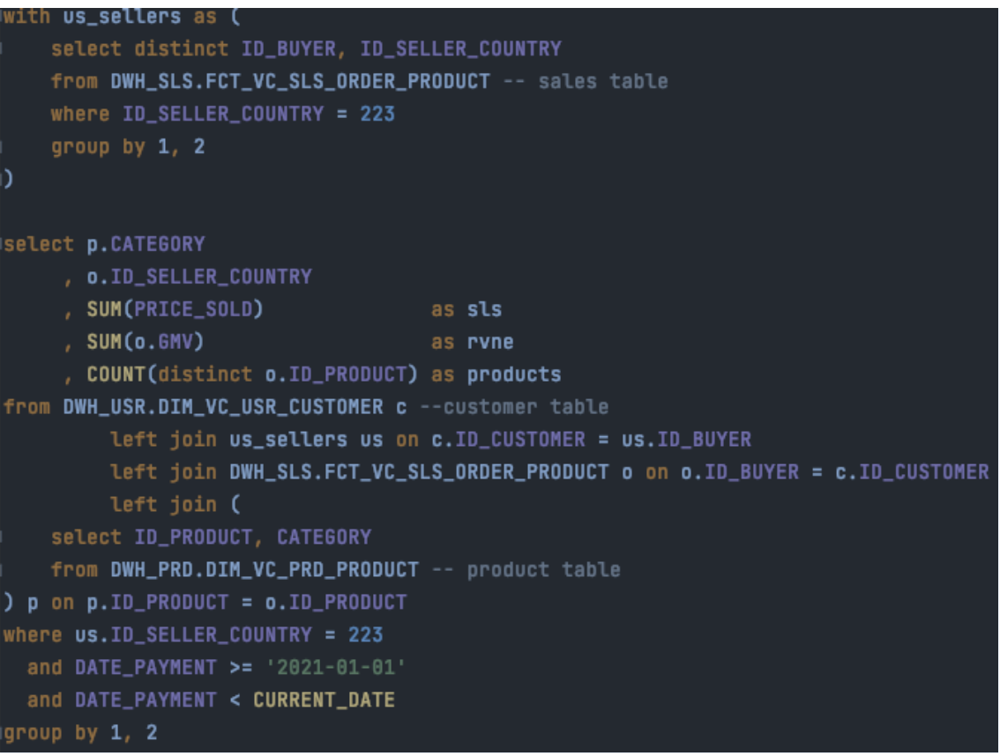

# BI Engineering Test

Please note you will need the following files to complete this test:
- **sales.csv**
- **country.csv**

All answers require you to submit the solution as a query and not a result (except questions
4 and 7). You may use any SQL syntax you are familiar with to complete the test.

Please submit your answers back to your interviewer as discussed during your interview or
outlined in the email. If you have no frame of reference, you should return the test within 2
business days. You may attach your answers within this document or in a separate file.

The last note we would like to add is, we know your time is valuable and we really appreciate
you taking the time to do this test, it will greatly assist with assessing your skills and
providing valuable feedback.

When writing queries, keep the following in mind -> Write simple not complex. Readability is
important. Use logical names for everything.

1. What are the top 10 brands by sales in the sales.csv table?
2. Write a query to calculate the contribution (in percentage) of each country to the total
by both sales and nb of items sold. I.e. If France sold 10/100 items, then you should
have 10% as the contribution for France of items sold.
3. Which two countries had the best relationship in terms of sales? Include the sales in
both directions, e.g. If France sells to Germany and Germany sells to France, then
you must aggregate both into a single row in your table.
4. When and why should you create a table or a view?
5. What percentage of all buyers are repeat buyers represented in the second week by
number of customers? (you may assume week 1 as the 1/1/2021 to 7/1/2021 and the
second week as 8/1/2021 to 15/1/2021)
6. What was the total sales of repeat buyers in the first week compared to the second
week? (answer in % increase or decrease). Note that you must first find the repeat
buyers in week 2, and then use this list to calculate the sales in both weeks.
7. The business has approached you wanting to implement a new tool that is able to
combine data from several sources easily and provide basic visualisation capabilities.
What would you consider in your decision making process and why?
​

8. Write a statement to do the following:
    - Change the region of Australia and New Zealand to ‘OCEA’
    - Insert a new row with the following values ID_COUNTRY = 246, REGION = ‘SPACE’, COUNTRY = ‘Mars’, 
    - Delete the row with ID_   COUNTRY = 0
_

Tip: It can be done with a single statement:

https://docs.snowflake.com/en/sql-reference/sql/merge.html

https://www.sqlshack.com/understanding-the-sql-merge-statement/
​

9. Write a query that is able to take all `id_buyers` split into odd and even groups in a JSON format. Your output should consist of two arrays inside of a json

```json
{
Id
_
buyers: [2,4,6...]
Is
even: true
_
},
{
Id
_
buyers: [1,3,5...]
even: false
Is
}
_
```


Hints:

https://docs.snowflake.com/en/sql-reference/functions/listagg.html

https://docs.snowflake.com/en/sql-reference/functions/object_construct.html
​

10. Make a list of everything you think can be improved in the following query.
Note: There is a lot to be improved here, be very critical.


​